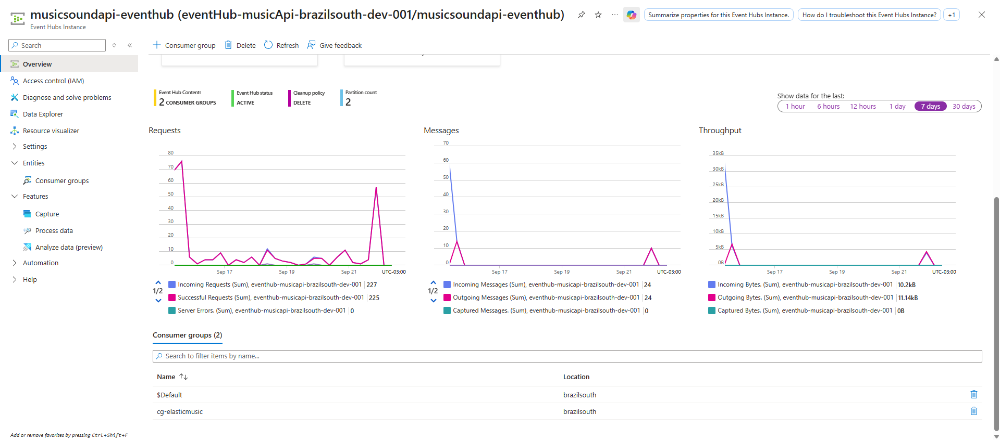
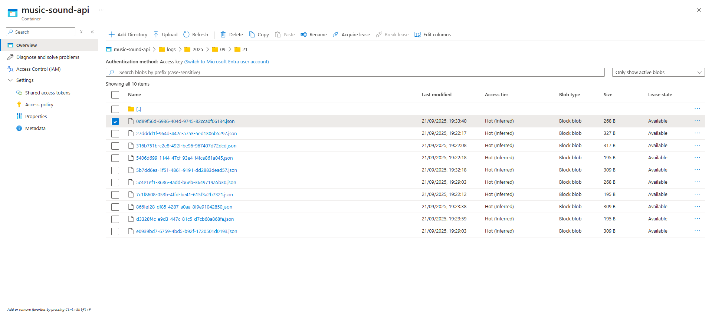

# 📌 MusicSoundAPI

API desenvolvida em **.NET 8** com **Entity Framework Core**, focada em fornecer endpoints para gerenciamento de músicas, artistas.  
O projeto segue boas práticas de arquitetura e é ideal como base para estudos ou aplicações reais relacionadas ao domínio musical.

Além disso, este projeto integra **Azure Blob Storage**, **Azure Event Hub** e **Serilog** em uma **Class Library .NET Standard 2.0**, 
permitindo o envio e armazenamento de logs para monitoramento centralizado e em tempo real.

---

## 🛠 Tecnologias Utilizadas

- **.NET 8 (ASP.NET Core Web API)** → Framework moderno e performático para construção de APIs RESTful.  
- **Entity Framework Core** → ORM utilizado para mapeamento objeto-relacional e acesso ao banco de dados.  
- **LINQ** → Consultas mais legíveis e expressivas diretamente em C#.  
- **Dependency Injection (DI)** → Gerenciamento de serviços e repositórios com baixo acoplamento.  
- **Swagger / Swashbuckle** → Documentação interativa da API.  
- **Migrations (EF Core)** → Controle de versão do banco de dados.
- **Serilog** → Biblioteca de logging flexível e extensível. 
- **Azure Blob Storage** → Serviço de armazenamento de objetos da Microsoft.
- **Azure Event Hub** → Serviço de ingestão de eventos em tempo real. 
---

## ⚙️ Funcionalidades Principais

- 🔹 **Gerenciamento de músicas**: cadastro e listagem de músicas de acordo com o artista.  
- 🔹 **Controle de artistas**: cadastro e listagem de artistas.  
- 🔹 **Documentação via Swagger**: acesso rápido e fácil para testar os endpoints.
- 🔹 **Envio de logs em tempo real** para o Event Hub.



- 🔹 **Armazenamento persistente** de logs no Blob Storage.
   


**Exemplo de Log gerado**

```
{
   "CorrelationalId":"e4f17a80-a884-4aa3-8c5e-d8d6393a3428",
   "TimeStamp":"2025-09-21T22:33:39.985\u002B0",
   "Application":"MusicSoundAPI",
   "Source":"GetArtistById",
   "Code":"404",
   "Message":"Artista nao encontrado",
   "Level":"Error",
   "Properties":{
      "Properties":{
         "Properties":37
      }
   }
}
```

---

## 📖 Estrutura do Projeto

```
MusicSoundAPI/
 ┣ Controllers/       → Endpoints da API
 ┣ Models/            → Entidades e DTOs
 ┣ Data/              → DbContext e configurações do EF Core
 ┣ Services/          → Regras de negócio
 ┣ Program.cs         → Configuração inicial da aplicação
 ┗ appsettings.json   → Configurações do projeto e banco de dados

MonitoringLogs/
 ┣ Services/            → Regras de Negócio do Azure
 ┣ Models/              → Entidades e DTOs de Log
 ┗ Middleware/          → Envia os Logs para Blob Storage e EventHub
```

---

## 🛠 Futuras Melhorias

- **Implementar Autenticação e Autorização** → Utilizar Pacotes da Microsoft de Autenticação para segurança.  
- **Visualização no Kibana** → Integrar os Logs da Azure ao Elasticsearch e monitorar a aplicação por meio de dashboards.  

🔗 **Autor:** [Álvaro](https://github.com/GitAlvaro-student)  
